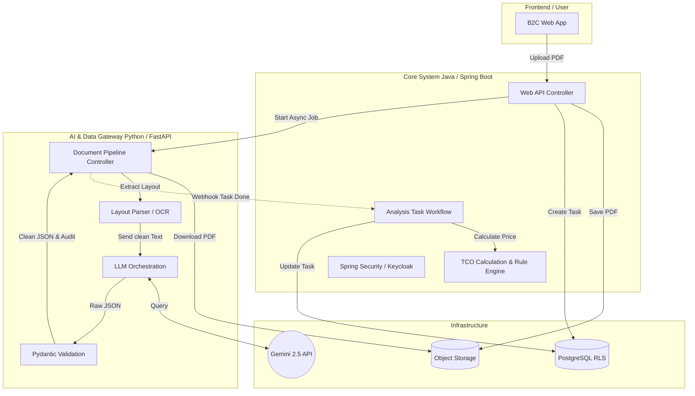

```mermaid
graph TD
    subgraph "Frontend / User"
        UI[B2C Web App]
    end

    subgraph "Core System Java / Spring Boot"
        Controller[Web API Controller]
        TaskMgr[Analysis Task Workflow]
        Rules[TCO Calculation & Rule Engine]
        Sec[Spring Security / Keycloak]
    end

    subgraph "AI & Data Gateway Python / FastAPI"
        Pipeline[Document Pipeline Controller]
        Parser[Layout Parser / OCR]
        Validator[Pydantic Validation]
        LLM_SDK[LLM Orchestration]
    end

    subgraph "Infrastructure"
        DB[(PostgreSQL RLS)]
        S3[(Object Storage)]
        Gemini((Gemini 2.5 API))
    end

    UI -->|Upload PDF| Controller
    Controller -->|Save PDF| S3
    Controller -->|Create Task| DB
    Controller -->|Start Async Job| Pipeline
    
    Pipeline -->|Download PDF| S3
    Pipeline -->|Extract Layout| Parser
    Parser -->|Send clean Text| LLM_SDK
    LLM_SDK <-->|Query| Gemini
    LLM_SDK -->|Raw JSON| Validator
    Validator -->|Clean JSON & Audit| Pipeline
    
    Pipeline -.->|Webhook Task Done| TaskMgr
    TaskMgr -->|Calculate Price| Rules
    TaskMgr -->|Update Task| DB
```
